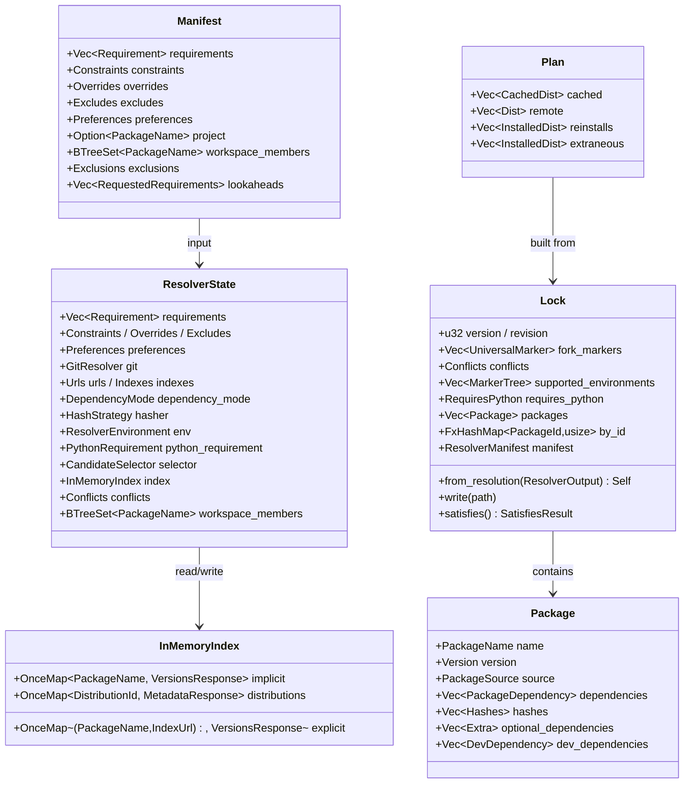

# uv: PubGrub Solver & Core Command Flows

## Table of Contents

- [Top-Level Dispatch](#top-level-dispatch)
- [Core Data Structures &amp; Relationships](#core-data-structures--relationships)
- [PubGrub Solver — Full Algorithm](#pubgrub-solver--full-algorithm)
- [Install Pipeline](#install-pipeline)
- [Subcommand Flows Summary](#subcommand-flows-summary)
- [Key Algorithms Reference](#key-algorithms-reference)
- [Crate Dependency Map](#crate-dependency-map)

---

## Top-Level Dispatch

The entire flow begins at `crates/uv/src/lib.rs:2741`:

```
main() [lib.rs:2741]
  └─ Cli::try_parse_from()              # clap arg parsing
  └─ tokio::runtime + thread "main2"    # custom stack size
  └─ run(cli) [lib.rs:93]
       ├─ resolve --project / CWD
       ├─ parse external cmd (for uv run)
       ├─ load FilesystemOptions        # uv.toml / pyproject.tool.uv
       ├─ Workspace::discover()
       ├─ uv_preview::set / finalize
       ├─ Cache::from_settings()
       ├─ BaseClientBuilder::new()
       └─ match command { ... dispatch to handler }
```

The big `match` (lib.rs:542) dispatches to per-command functions living in `crates/uv/src/commands/`. Each subcommand directory — `pip/`, `project/`, `tool/`, `python/` — contains its own handler files.

---

## Core Data Structures & Relationships



### Key types and their source locations

| Type                            | File                                      | Line |
| ------------------------------- | ----------------------------------------- | ---- |
| `Lock`                          | `uv-resolver/src/lock/mod.rs`             | 259  |
| `Manifest`                      | `uv-resolver/src/manifest.rs`             | 16   |
| `Resolver<Provider, Installed>` | `uv-resolver/src/resolver/mod.rs`         | 100  |
| `ResolverState`                 | `uv-resolver/src/resolver/mod.rs`         | 107  |
| `InMemoryIndex`                 | `uv-resolver/src/resolver/index.rs`       | 12   |
| `Plan`                          | `uv-installer/src/planner.rs`             | —    |
| `Resolution`                    | `uv-distribution-types/src/resolution.rs` | —    |

---

## PubGrub Solver — Full Algorithm

The resolution engine lives in `crates/uv-resolver/src/resolver/mod.rs:314` (`solve()`). It's an adaptation of the **PubGrub** SAT algorithm (also used by Dart/pub).

### Architecture: two-thread design

```
Resolver::resolve()                     [mod.rs:277]
  ├── mpsc::channel(300)                # request_sink / request_stream
  ├── spawn FETCHER thread (async)      # state.clone().fetch(provider, stream)
  ├── spawn SOLVER thread (sync)        # state.clone().solve(&request_sink)
  └── tokio::try_join!(fetch, solve)
```

The solver is CPU-bound (PubGrub logic), the fetcher is IO-bound (HTTP + build). They communicate through a bounded mpsc channel of capacity 300 (large enough for batch prefetching).

### Solver main loop

```
solve()                                 [mod.rs:314]
  │
  ├─ State::init(Root, MIN_VERSION)
  ├─ initial_forked_states()            # split by requires-python markers
  │
  ├─ FORK LOOP (for each ForkState):
  │    │
  │    LOOP:
  │    │
  │    a. unit_propagation()
  │    │   - derive forced assignments from existing incompatibilities
  │    │   - conflict? → ConvertNoSolutionErr with derivation chain
  │    │
  │    b. pre_visit()
  │    │   - prefetch metadata for all prioritized packages
  │    │
  │    c. reprioritize_conflicts()      # mod.rs:751
  │    │   - CONFLICT_THRESHOLD = 5     # mod.rs:98
  │    │   - packages with >5 conflicts get priority bump
  │    │   → reduces backjumping
  │    │
  │    d. pick_highest_priority_pkg()
  │    │   - from partial_solution via priorities
  │    │
  │    e. request_package()
  │    │   - if registry: request all versions from index
  │    │   - if URL: request single dist metadata
  │    │   - InMemoryIndex::register() + request_sink.blocking_send()
  │    │
  │    f. choose_version()              # mod.rs:1073
  │    │   ├── Root         → MIN_VERSION
  │    │   ├── Python       → None (no-op)
  │    │   ├── Package/...  → choose_version_registry()
  │    │   │   or choose_version_url()
  │    │   └── Returns Unforked(ver) | Forked(forks) | Unavailable
  │    │
  │    ├── choose_version_registry()    # mod.rs:1134+
  │    │   - wait_blocking on InMemoryIndex for version list
  │    │   - CandidateSelector picks best Candidate
  │    │   - applies: requires-python, tags, markers, preferences
  │    │   - handles upgrade/reinstall/exclusions
  │    │
  │    g. get_dependencies_forking()    # mod.rs:1734
  │    │   get_dependencies() + .fork()
  │    │   - non-universal mode: always Unforked
  │    │   - universal mode: split by marker divergence
  │    │   → ForkedDependencies::Unforked | Forked | Unavailable
  │    │
  │    h. if Forked:
  │    │   - sort forks (strategy-dependent:
  │    │     Fewest/Lowest → lower Python first
  │    │     RequiresPython → higher Python first)
  │    │   - push back to forked_states stack
  │    │
  │    i. if Unforked:
  │    │   - add_decision() or add_incompatibility()
  │    │   - backtrack on conflict (PubGrub CDCL)
  │    │
  │    j. all assigned → into_resolution()
  │       → push to resolutions[]
  │
  └─ merge all fork resolutions → ResolverOutput
       → Lock::from_resolution()
```

### Forking logic (environment.rs)

Universal resolution mode creates **independent PubGrub states** when marker expressions diverge. Example: if `foo` has deps conditioned on `python_version >= "3.8"` vs `< "3.8"`, the solver forks into two environments, each solving independently. Fork markers are tracked as `UniversalMarker` in the lockfile.

The key function is `fork_version_by_marker()` / `fork_version_by_python_requirement()` in `uv-resolver/src/resolver/environment.rs`.

### Prefetch architecture

The `BatchPrefetcher` (batch_prefetch.rs) runs asynchronously alongside the solver thread. It pre-emptively fetches metadata for packages the solver is likely to visit next, based on priority ordering from `partial_solution.prioritized_packages()`. This happens at step (b) above — before the solver picks a package, all candidates are already being fetched.

The `InMemoryIndex` uses `OnceMap` (from `uv-once-map` crate), where the first thread to `register()` a key is responsible for computing its value. The solver thread calls `wait_blocking()` and blocks until the fetcher thread produces the data.

---

## Install Pipeline

Located in `crates/uv-installer/src/`.

### Flow

```
Resolution (ResolverOutput)
    │
    ▼
Planner::new(resolution).build()
    │  Topological sort of dependency graph
    │  Compare with SitePackages (installed)
    ▼
Plan {
    cached:    Vec<CachedDist>,     # already in cache, only needs linking
    remote:    Vec<Dist>,           # needs download or build
    reinstalls: Vec<InstalledDist>, # version changed, reinstall
    extraneous: Vec<InstalledDist>, # no longer needed, remove
}
    │
    ▼
Preparer::prepare()
    │  Parallel download of wheels + build of sdists
    ▼
CachedDist[]
    │
    ▼
Installer::install_blocking()
    │  Write wheel files into site-packages:
    │  - unzip .whl
    │  - install RECORD, METADATA, entry_point scripts
    │  - handle INSTALLER metadata
    ▼
compile_bytecode() (optional --compile)
```

### Key types

| Component              | Crate             | Responsibility                                             |
| ---------------------- | ----------------- | ---------------------------------------------------------- |
| `Planner`              | `uv-installer`    | Compute install plan (topological, diff against installed) |
| `Preparer`             | `uv-installer`    | Parallel download/build of wheels                          |
| `Installer`            | `uv-installer`    | Wheel extraction + site-packages write                     |
| `Plan`                 | `uv-installer`    | Partitioned install queue                                  |
| `SitePackages`         | `uv-installer`    | Snapshot of currently installed packages                   |
| `DistributionDatabase` | `uv-distribution` | Async metadata fetching + building                         |
| `BuildDispatch`        | `uv-dispatch`     | Build isolation coordination                               |

---

## Subcommand Flows Summary

| Command            | Pipeline                                               | Implementation file          |
| ------------------ | ------------------------------------------------------ | ---------------------------- |
| `pip compile`      | read_reqs → resolve → display                          | `commands/pip/compile.rs`    |
| `pip install`      | read_reqs → resolve → plan → prepare → install         | `commands/pip/install.rs`    |
| `pip sync`         | read_reqs → resolve → plan → prepare → install (exact) | `commands/pip/sync.rs`       |
| `sync`             | workspace → lock/resolve → install                     | `commands/project/sync.rs`   |
| `run`              | workspace → lock/resolve → sync → exec                 | `commands/project/run.rs`    |
| `lock`             | workspace → resolve → write uv.lock                    | `commands/project/lock.rs`   |
| `add`              | parse → edit pyproject → lock → sync                   | `commands/project/add.rs`    |
| `remove`           | remove dep → edit pyproject → lock → sync              | `commands/project/remove.rs` |
| `init`             | create pyproject.toml + venv (opt seed)                | `commands/project/init.rs`   |
| `venv`             | find python → create_venv                              | `commands/venv.rs`           |
| `build`            | source_build → sdist → wheel                           | `commands/build_frontend.rs` |
| `tool run` / `uvx` | resolve → install_tool → exec                          | `commands/tool/run.rs`       |
| `tool install`     | resolve → install → link bins                          | `commands/tool/install.rs`   |
| `publish`          | read dist → auth → upload HTTP                         | `commands/publish.rs`        |
| `python install`   | fetch metadata → download → extract                    | `commands/python/install.rs` |

---

## Key Algorithms Reference

| Algorithm                     | File                                         | Line | Summary                                                                     |
| ----------------------------- | -------------------------------------------- | ---- | --------------------------------------------------------------------------- |
| **PubGrub SAT**               | `uv-resolver/src/resolver/mod.rs`            | 314  | Unit propagation + conflict derivation + backjumping, adapted from Dart/pub |
| **Forking resolution**        | `uv-resolver/src/resolver/environment.rs`    | —    | Split by requires-python & markers → independent PubGrub states → merge     |
| **Batch prefetch**            | `uv-resolver/src/resolver/batch_prefetch.rs` | —    | Speculatively fetch metadata of prioritized packages in parallel            |
| **Install planning**          | `uv-installer/src/planner.rs`                | —    | Topological sort, partition into cached/remote/reinstall/extraneous         |
| **Universal markers**         | `uv-resolver/src/universal_marker.rs`        | —    | OS+arch+ABI composition for cross-platform uv.lock                          |
| **Conflict reprioritization** | `uv-resolver/src/resolver/mod.rs`            | 98   | CONFLICT_THRESHOLD=5: reprioritize packages with >5 conflicts               |
| **Signal forwarding**         | `crates/uv/src/child.rs`                     | —    | TTY heuristic: non-TTY → forward SIGINT; TTY → terminal handles PG          |

---

## Crate Dependency Map (Selected)

```
uv-cli (clap commands)
    ↓
uv (main binary, dispatch in lib.rs)
    ├── uv-workspace       (pyproject.toml discovery)
    ├── uv-requirements    (requirements parsing)
    ├── uv-resolver        (PubGrub solver, Lock, Manifest)
    │     ├── uv-distribution          (package metadata fetching)
    │     ├── uv-distribution-types    (Dist, Resolution types)
    │     └── uv-client                (HTTP registry client)
    ├── uv-dispatch        (build coordination)
    │     ├── uv-build-frontend        (PEP 517 build)
    │     └── uv-distribution
    ├── uv-installer       (Planner, Preparer, Installer)
    │     ├── uv-install-wheel         (wheel unpack & install)
    │     └── uv-python                (interpreter discovery)
    │           ├── uv-virtualenv      (venv creation)
    │           └── uv-platform-tags   (abi/platform tags)
    └── uv-python
```

Infrastructure (used by all): `uv-pep440`, `uv-pep508`, `uv-normalize`, `uv-fs`, `uv-cache`, `uv-git`, `uv-auth`, `uv-static`, `uv-errors`, `uv-warnings`, `uv-settings`, `uv-configuration`, `uv-pypi-types`, `uv-toml`, `uv-once-map`, `uv-redacted`, `uv-console`, `uv-small-str`, `uv-macros`, `uv-state`.

---

> Version: commit `9bac00033` (main branch) · Date: 2026-05-25
