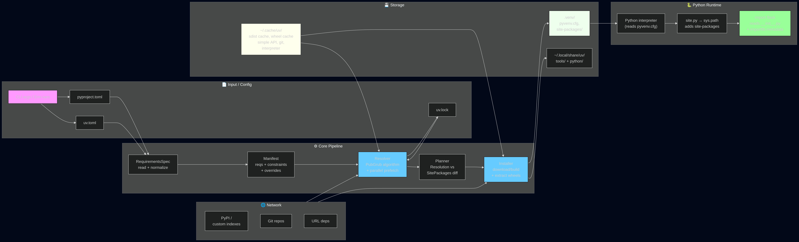

# uv-Python Bridge: How uv Writes Files That Python Reads Transparently

## Table of Contents

- [Core Insight](#core-insight)
- [The Bridge Diagram](#the-bridge-diagram)
- [Virtualenv Creation: pyvenv.cfg](#virtualenv-creation-pyvenvcfg)
- [Wheel Installation: site-packages + dist-info](#wheel-installation-site-packages--dist-info)
- [The Scheme Struct: Connecting to sysconfig](#the-scheme-struct-connecting-to-sysconfig)
- [Entry Points and Scripts](#entry-points-and-scripts)
- [Editable Installs: .pth Files](#editable-installs-pth-files)
- [Python Import Flow (post-uv-install)](#python-import-flow-post-uv-install)
- [Tool Isolation: ~/.local/share/uv/tools](#tool-isolation-localshareuvtools)
- [Filesystem Artifacts Summary](#filesystem-artifacts-summary)
- [Architecture Rule](#architecture-rule)

---

## Core Insight



**Python never feels uv's existence.** uv writes files to standard filesystem locations using standard formats (PEP 427, PEP 376, PEP 405). Python reads them through normal stdlib paths (`site.py`, `importlib`, `sys.path`). There is no RPC, no inter-process communication, no special protocol — just files that conform to CPython's built-in expectations.

---

## The Bridge Diagram

```
uv INSTALLER (rust)               FILESYSTEM                     PYTHON RUNTIME (cpython)
────────────────────              ──────────                     ─────────────────────────

install_wheel()
  │                                  .venv/
  ├── link_wheel_files()             ├── pyvenv.cfg  ───── site.py reads at startup
  │   (copy/extract .whl)            │    home=/usr         ├── "I'm in a venv!"
  │                                  │    uv=0.6.x          ├── set sys.prefix=.venv
  │                                  │    version_info=3.12 │── add site-packages to sys.path
  │                                  │                      │
  ├── write_entrypoints()            ├── bin/
  │   (console_scripts)              │   ├── python3 -> /usr/bin/python3
  │                                  │   ├── flask  ───────── python -m flask  (shebang patched)
  │                                  │   └── activate
  │                                  │
  ├── link/symlink to:               ├── lib/python3.12/
  │   .venv/.../site-packages/       │   └── site-packages/
  │                                  │       ├── flask/  ───── import flask → __init__.py
  │                                  │       │   ├── __init__.py
  │                                  │       │   ├── app.py
  │                                  │       │   └── ...
  │                                  │       │
  │                                  │       ├── flask-3.0.0.dist-info/
  │                                  │       │   ├── METADATA  ── importlib.metadata.version("flask")
  │                                  │       │   ├── RECORD    ── uv reads for uninstall
  │                                  │       │   ├── WHEEL
  │                                  │       │   ├── INSTALLER  (content: "uv")
  │                                  │       │   └── entry_points.txt
  │                                  │       │
  └── write_record()                 │       └── __pycache__/  ── Python bytecode cache
                                     │           └── flask/
                                     │               └── __init__.cpython-312.pyc
                                     │
```

---

## Virtualenv Creation: pyvenv.cfg

**File**: `crates/uv-virtualenv/src/virtualenv.rs:490`

uv generates `pyvenv.cfg` with these fields:

```python
# .venv/pyvenv.cfg — written by uv, read by Python's site.py
home = /usr                          # base interpreter location
implementation = CPython
version_info = 3.12.3
uv = 0.6.x                           # uv marks its version here (ignored by Python)
include-system-site-packages = false
prompt = .                           # venv prompt name
```

**What Python does with it** (CPython `Lib/site.py`):

1. Reads `pyvenv.cfg` — detects it is in a virtualenv
2. Sets `sys.prefix` = directory containing `pyvenv.cfg` (i.e., `.venv/`)
3. Sets `sys.exec_prefix` = same directory
4. Adds `.venv/lib/python3.12/site-packages/` to `sys.path`
5. Uses `home` field to find the real system interpreter for extension module compilation

No uv code is consulted by Python at any point.

---

## Wheel Installation: site-packages + dist-info

**Entry point**: `crates/uv-install-wheel/src/install.rs:29` `install_wheel()`

uv follows the [PEP 427 wheel install spec](https://packaging.python.org/en/latest/specifications/binary-distribution-format/#installing-a-wheel-distribution-1-0-py32-none-any-whl) step by step:

```
install_wheel(layout, relocatable, wheel, filename, ...)
  │
  ├─ 1.a Parse dist-info/WHEEL                     (Root-Is-Purelib? → purelib vs platlib)
  ├─ 1.b Validate Wheel-Version
  ├─ 1.c/d Unpack into (purelib|platlib)/           (= site-packages/)
  │
  ├─ link_wheel_files(link_mode, site_packages, ...)
  │   └─ Mode: Hardlink | Copy | Symlink | Clone  ← uv's --link-mode
  │
  ├─ Parse RECORD from original .whl
  ├─ parse_scripts → write entry_points            (bin/ scripts)
  ├─ install_data → move .data/ subdirectories
  │   (purelib | platlib | scripts | headers | data)
  ├─ write_installer_metadata                       (dist-info/INSTALLER + direct_url.json)
  └─ write_record                                   (updated RECORD with new scripts/data)
```

**Three metadata files uv writes** (key content):

| File                          | Content                            | Who reads it                    |
| ----------------------------- | ---------------------------------- | ------------------------------- |
| `.dist-info/METADATA`         | Name, Version, Requires-Dist, ...  | `importlib.metadata`            |
| `.dist-info/RECORD`           | CSV of all files + hashes          | uv's uninstall                  |
| `.dist-info/INSTALLER`        | Text: `uv`                         | Tool ownership tracking         |
| `.dist-info/WHEEL`            | Wheel version, tags                | (preserved from original)       |
| `.dist-info/direct_url.json`  | URL/git info for non-PyPI installs | `pip list --format=json`, tools |
| `.dist-info/entry_points.txt` | console_scripts, gui_scripts       | uv generates bin/ from this     |

---

## The Scheme Struct: Connecting to sysconfig

**File**: `crates/uv-pypi-types/src/scheme.rs:11`

```rust
pub struct Scheme {
    pub purelib: PathBuf,    // site-packages for pure Python
    pub platlib: PathBuf,    // site-packages for platform-specific (C extensions)
    pub scripts: PathBuf,    // entry-point scripts
    pub data: PathBuf,       // package data files
    pub include: PathBuf,    // C headers for C extension builds
}
```

This struct maps directly to CPython's `sysconfig.get_paths()`:

| Python sysconfig key | uv Scheme field | Example value                        |
| -------------------- | --------------- | ------------------------------------ |
| `purelib`            | `purelib`       | `.venv/lib/python3.12/site-packages` |
| `platlib`            | `platlib`       | `.venv/lib/python3.12/site-packages` |
| `scripts`            | `scripts`       | `.venv/bin`                          |
| `data`               | `data`          | `.venv`                              |
| `include`            | `include`       | `.venv/include`                      |

uv discovers these paths by running a Python probe at interpreter-discovery time
(`crates/uv-python/src/interpreter.rs:966` `InterpreterInfo::query()`):

```python
# uv generates this script and runs it via the target interpreter
import sysconfig, json, sys
print(json.dumps({
    "scheme": sysconfig.get_paths(),     # ← the Scheme struct is populated from this
    "sys_path": sys.sys.path,            # ← uv uses this to find existing packages
    "markers": {...},                    # ← PEP 508 marker environment
    "stdlib": sysconfig.get_path("stdlib"),
    ...
}))
```

**Why this matters**: uv does NOT hardcode `.venv/lib/python3.12/site-packages/`. It asks the
target Python interpreter for its actual installation paths, then stores them in `Scheme`.
This is what makes uv work across all Python implementations (CPython, PyPy, GraalPy) and
all operating systems.

---

## Entry Points and Scripts

**File**: `crates/uv-install-wheel/src/script.rs` and `install.rs:88-113`

uv reads `entry_points.txt` from the wheel's `.dist-info/` and generates executable scripts:

```
entry_points.txt content:
  [console_scripts]
  flask = flask.cli:main

uv generates:  .venv/bin/flask
  ──  #!.venv/bin/python
  ──  import sys; from flask.cli import main; sys.exit(main())
```

Shebangs are patched to point to the venv's Python, not the system Python.

---

## Editable Installs: .pth Files

For `pip install -e .` (editable mode), uv writes a **`.pth` file** into site-packages:

```
.editable.uv/<hash>.pth  (or legacy: easy-install.pth)
Content:
  /home/user/projects/mypackage/src
```

**How Python processes `.pth` files** (CPython `site.py`):

```
site.py → reads all .pth files in site-packages/
  ├── each line is a path to add to sys.path
  ├── if line starts with "import", execute it (used for setuptools namespace packages)
  └── result: mypackage is importable from its source tree
```

The `easy-install.pth` file (from legacy setuptools) is also supported for uninstall
(`crates/uv-install-wheel/src/uninstall.rs:388`).

---

## Python Import Flow (post-uv-install)

When a user runs `uv run flask --version`, the chain is:

```
1. Shell:    PATH=.venv/bin:$PATH → finds .venv/bin/python3
2. Python:   reads .venv/pyvenv.cfg
3. site.py:  adds .venv/lib/python3.12/site-packages/ to sys.path
4. import flask:
      sys.path → site-packages/
      ├── flask/__init__.py  FOUND ← uv extracted from .whl
      ├── compile→__pycache__/__init__.cpython-312.pyc
      └── module loaded
5. importlib.metadata.version("flask"):
      → opens flask-3.0.0.dist-info/METADATA
      → reads "Version: 3.0.0"  ← this file was written by uv
6. Python runs: flask.cli:main()
```

**No uv process is involved at runtime.** The import is indistinguishable from a
manually-created virtualenv or a `pip install`.

---

## Tool Isolation: ~/.local/share/uv/tools

For `uv tool run ruff` / `uvx ruff`:

```
~/.local/share/uv/tools/ruff/
  ├── pyvenv.cfg
  ├── bin/
  │   ├── python3  → /usr/bin/python3
  │   └── ruff     → python -m ruff  (entry point)
  ├── lib/python3.12/site-packages/
  │   ├── ruff/
  │   └── ruff-0.6.0.dist-info/
  └── uv-receipt.toml     ← UV-SPECIFIC (not read by Python)
      └── tool name, version, entry points, requirements
```

The `uv-receipt.toml` is the only uv-specific file. Python never reads it. It's used by
`tool list`, `tool upgrade`, and `tool uninstall` to track what was installed.

**Execution flow:**

```
uvx ruff --help
  → InstalledTools::from_settings()
  → if installed: find uv-receipt.toml, locate venv
  → spawn: .venv/bin/ruff args...
  → Python runs the same import machinery as above
```

---

## Filesystem Artifacts Summary

| Artifact                              | Created by uv       | Read by Python       | Purpose                       |
| ------------------------------------- | ------------------- | -------------------- | ----------------------------- |
| `.venv/pyvenv.cfg`                    | `uv venv`           | `site.py` at startup | Marks venv, sets `sys.prefix` |
| `site-packages/*/`                    | `uv sync/install`   | `import` statement   | Module code                   |
| `site-packages/*.dist-info/METADATA`  | `uv sync/install`   | `importlib.metadata` | Package version, deps         |
| `site-packages/*.dist-info/RECORD`    | `uv sync/install`   | —                    | uv's uninstall                |
| `site-packages/*.dist-info/INSTALLER` | `uv sync/install`   | —                    | Ownership metadata            |
| `bin/<entry-point>`                   | `uv sync/install`   | Shell/exec           | CLI entry point               |
| `.pth` files                          | `uv add --editable` | `site.py`            | Editable import paths         |
| `uv-receipt.toml`                     | `uv tool install`   | —                    | uv's tool tracking            |
| `~/.cache/uv/**/*`                    | All commands        | —                    | Package/build cache           |
| `~/.local/share/uv/python/`           | `uv python install` | `PYTHON` env         | Managed interpreters          |
| `uv.lock`                             | `uv lock/sync/add`  | —                    | Lock file (TOML)              |
| `pyproject.toml`                      | User / `uv init`    | —                    | Project definition            |

---

## Architecture Rule

**uv writes to the filesystem; Python reads from the filesystem. They never talk directly.**

This is the same architectural pattern as Docker: Docker writes layers to disk using
overlayfs, and the Linux kernel presents them as a unified filesystem. The running
process does not know Docker exists. Similarly, uv writes wheels to `site-packages/`
and Python reads them via `import`.

```
uv ─── writes ───▶ filesystem (standard layout) ◀─── reads ─── Python
                        ↑
                   no IPC, no RPC,
                   just PEP-compliant files
```

<!-- Last updated: 2026-05-25 -->
<!-- Source: uv main branch at 9bac00033 -->
